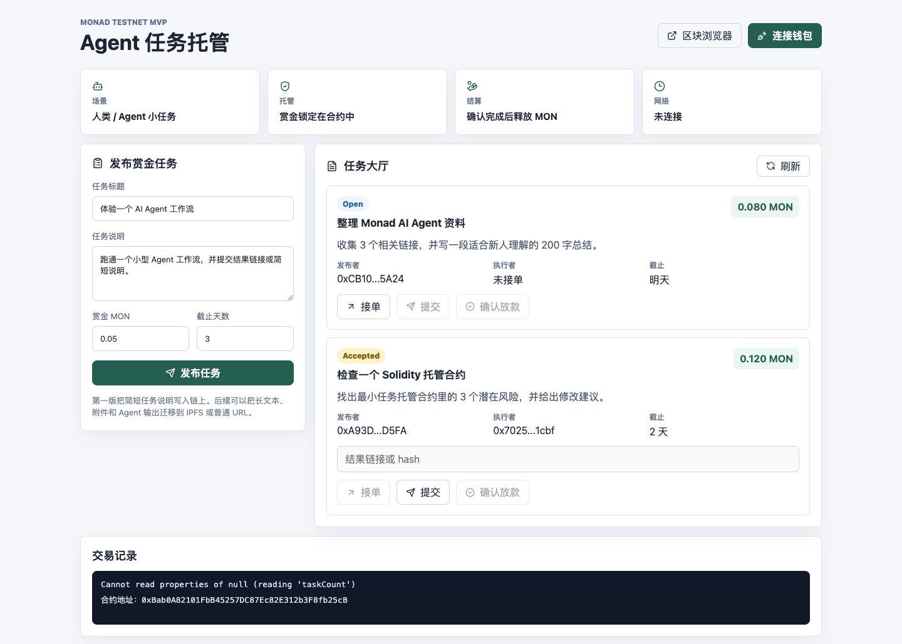

# Week 3 学习记录

> 主方向：Dev<br>
> 项目：Agent 任务托管（Agent Bounty Escrow）<br>
> 记录周期：2026-07-14 至 2026-07-20<br>
> 最后更新：2026-07-15

## 本周目标

在公开 Demo 中，用两个钱包完整跑通一笔 Monad Testnet 任务，并留下可以复查的交易记录：

```text
钱包 A 发布任务并锁定赏金
-> 钱包 B 接单
-> 钱包 B 提交结果
-> 钱包 A 确认完成
-> 合约向钱包 B 放款
```

本周不扩展 DAO 仲裁、信誉积分、NFT、跨链或主网部署。先解决当前读取错误，再完成双钱包实测和最小合约测试。

## 快速索引

- [每日记录](#每日记录)
- [资料链接](#资料链接)
- [Prompt 记录](#prompt-记录)
- [截图记录](#截图记录)
- [错误记录](#错误记录)
- [判断变化](#判断变化)
- [下一步计划](#下一步计划)

## 每日记录

### 2026-07-15：整理 AI Collaboration Log

**今天做了什么**

- 回看 Week 1 和 Week 2 的项目记录、Git 提交和公开 Demo。
- 把 AI 的贡献、人工删改与核查、不能交给 AI 的事项分开记录。
- 补充对外操作边界：AI 可以使用本机已有 Git 凭据执行获准的推送，但不掌握 GitHub 密码；每次仍需说明文件、分支和 commit。
- 生成可直接提交的 [AI Collaboration Log](WEEK2-AI-COLLABORATION-LOG.md)。

**今天的判断**

AI 协作记录不能只写“AI 提高效率”。钱包签名、资金安全、事实核验和发布权限必须明确由人负责；线上页面存在错误时，也不能因为代码和页面已经生成就宣称项目完成。

### 2026-07-14：确定 Dev 方向并建立记录方式

**今天做了什么**

- 根据 Week 1 和 Week 2 的实际进度，确定 Week 3 继续走 Dev 方向。
- 把项目目标收敛为“小额任务的链上托管与结算”，不重新换题。
- 明确本周最小交付：双钱包跑通一条真实测试网流程，并留下交易 hash。
- 建立这份公开学习记录，后续把资料、Prompt、截图、错误和判断变化集中在同一处。
- 打开公开 Demo 做基础检查，并保存当前页面截图。

**今天的结果**

- GitHub 仓库和 GitHub Pages 均可公开访问。
- 合约地址已经写入线上构建：`0xBab0A82101FbB45257DC87Ec82E312b3F8fb25cB`。
- 页面能正常加载，但读取任务时出现 `taskCount` 相关错误，尚未进入双钱包实测。

**今天的判断**

本周不应该继续添加功能。当前最有价值的工作是先定位线上读取失败的原因，再验证托管资金的完整状态流转。

## 资料链接

| 资料 | 用途 | 状态 |
| --- | --- | --- |
| [项目在线 Demo](https://CrimsonCap0.github.io/agent-bounty-escrow/) | 检查公开页面并完成双钱包实测 | 已访问，当前有读取错误 |
| [项目 GitHub 仓库](https://github.com/CrimsonCap0/agent-bounty-escrow) | 保存代码、文档、截图和更新历史 | 公开可访问 |
| [Monad Testnet 合约记录](https://testnet.monadvision.com/address/0xBab0A82101FbB45257DC87Ec82E312b3F8fb25cB) | 核对部署及后续交易 | 已有部署地址 |
| [Monad 官方文档](https://docs.monad.xyz/) | 核对当前网络、RPC 和 EVM 开发信息 | 待针对读取错误复查 |
| [Solidity 安全注意事项](https://docs.soliditylang.org/en/latest/security-considerations.html) | 检查外部调用、重入和状态更新顺序 | 本周测试时使用 |
| [ethers.js v6 文档](https://docs.ethers.org/v6/) | 检查 Provider、Contract、Signer 和错误处理 | 待针对读取错误复查 |
| [EIP-1193](https://eips.ethereum.org/EIPS/eip-1193) | 理解浏览器钱包 Provider 接口与事件 | 钱包联调时使用 |

## Prompt 记录

### Prompt 01：方向选择作业

```text
选择 Research / Ops / Dev 一个主方向，说明选择理由、服务的问题、本周最小产出、参考资料和 Week 3 角色。
提交形式：可上传截图、文档或可访问的页面链接。请确保内容清晰完整，链接权限已开放。
```

**用途：** 明确 Week 3 方向和最低交付边界。<br>
**结果：** 选择 Dev，继续完善 Agent 任务托管。<br>
**人工判断：** 选择来自前两周已有开发成果，不是因为 Dev 听起来更技术化。

### Prompt 02：建立持续学习记录

```text
建立本周学习记录，持续记录资料链接、Prompt、截图、错误、判断变化和下一步计划。
搞一个可访问的 doc，然后持续更新。
```

**用途：** 建立可以连续维护、公开访问的学习档案。<br>
**结果：** 使用 GitHub Markdown 文档和仓库内截图目录。<br>
**人工判断：** Notion 适合手工编辑，但当前没有稳定的 Notion 写入连接；GitHub 更适合由我和 AI 共同持续更新，也能保留版本历史。

### Prompt 03：AI Collaboration Log

```text
Week 2｜职业选择基础任务｜AI Collaboration Log

无论选择哪个方向，都提交一次 AI 协作记录，说明 AI 帮了什么、人类删改 / 核查了什么、哪些不能交给 AI。
```

**用途：** 复盘 Agent 任务托管开发中的真实人机分工。<br>
**结果：** 形成独立的公开协作记录，并明确钱包、事实核验、安全结论和对外发布的责任边界。<br>
**人工判断：** 不虚构 AI 节省的时间或完成度，只引用仓库、交易记录和当前错误等可核查信息。

## 截图记录

### 截图 01：公开 Demo 基础检查



- 时间：2026-07-14
- 页面：[Agent 任务托管 Demo](https://CrimsonCap0.github.io/agent-bounty-escrow/)
- 观察：页面布局和静态内容正常；钱包未连接；底部交易记录区出现 `taskCount` 读取错误。
- 结论：下一步先检查 RPC、合约实例创建和 ABI，再进行钱包交互。

## 错误记录

### ERR-001：线上页面读取 `taskCount` 失败

| 字段 | 记录 |
| --- | --- |
| 日期 | 2026-07-14 |
| 环境 | GitHub Pages，未连接钱包 |
| 错误信息 | `Cannot read properties of null (reading 'taskCount')` |
| 触发方式 | 打开公开 Demo，页面自动读取合约任务列表 |
| 当前影响 | 无法确认线上任务数据，阻塞双钱包完整流程 |
| 已知事实 | 页面加载成功；线上构建包含合约地址；错误发生在读取 `taskCount` 时 |
| 尚未确认 | RPC 是否仍可用、目标网络是否变化、合约实例为何为 `null`、ABI 与部署是否一致 |
| 下一步 | 在浏览器控制台和本地环境复现；检查 RPC 返回、合约 bytecode、`getContract(false)` 返回值及异常处理 |
| 状态 | 待定位 |

## 判断变化

### 2026-07-14：从“继续加功能”改为“先验证完整闭环”

**之前的想法：** 继续增加仲裁、信誉、NFT 或更完整的任务市场功能。<br>
**触发信息：** 公开页面虽然已经部署，但当前连基础任务读取都失败，双钱包流程也没有留下可复查记录。<br>
**现在的判断：** 暂停功能扩展，先修复读取问题、补最小测试并完成一次真实结算。<br>
**为什么改变：** 一个功能较少但能稳定完成托管与放款的 Demo，比页面功能很多但无法验证链上流程更有价值。

### 2026-07-14：从 Notion 改为 GitHub Markdown

**之前的想法：** 用 Notion 建一个公开页面。<br>
**触发信息：** 当前没有可持续写入 Notion 的连接，而项目代码和部署本来就在 GitHub。<br>
**现在的判断：** 主记录放在 GitHub；如后续需要更强的手工排版，再把此文档同步到 Notion。<br>
**为什么改变：** GitHub 链接可公开访问、修改有版本记录，后续更新也不依赖个人工作区登录状态。

## 下一步计划

- [ ] 定位并修复 `ERR-001`，确认线上页面可以读取 `taskCount`。
- [ ] 核对当前 Monad 网络、RPC、Chain ID 和合约 bytecode。
- [ ] 用钱包 A 创建一项小额测试任务，记录交易 hash。
- [ ] 用钱包 B 接单并提交结果，记录两笔交易 hash。
- [ ] 用钱包 A 确认完成，核对钱包 B 收到赏金并记录交易 hash。
- [ ] 补最小合约测试：权限错误、取消退款、状态转换。
- [ ] 请 2-3 位同学试用，记录他们在哪一步停顿或误解。
- [ ] 每次工作结束前更新本页的错误状态、判断变化和下一步。

## 补充
今天分享会邀请了嘉宾讲解DeSci的相关内容：https://equable-mountain-09d.notion.site/DeSci-3523ad5edf5c80809d20e9591cbaf8c8#3523ad5edf5c80caa494eb06c37e7190
